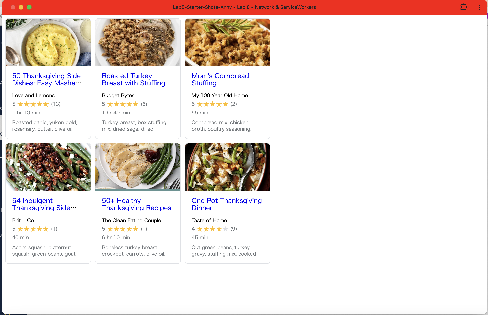

# Lab8-Starter

Shota Yasuraoka, Anny Zhao
https://shotayasuraoka.github.io/Lab8-Starter-Shota-Anny/

Graceful Degradation allows web applications to function even though some functions fail. Service workers run in the background and support this by providing offline access, background sync, etc, thus increasing application resiliency and UX in poor network conditions.

